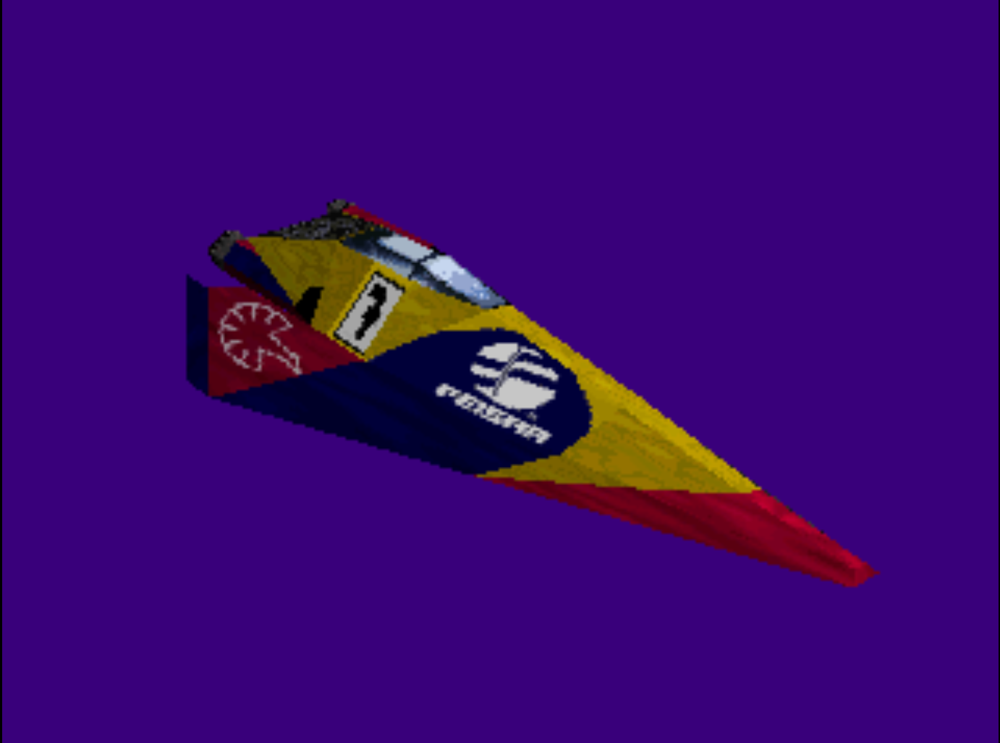
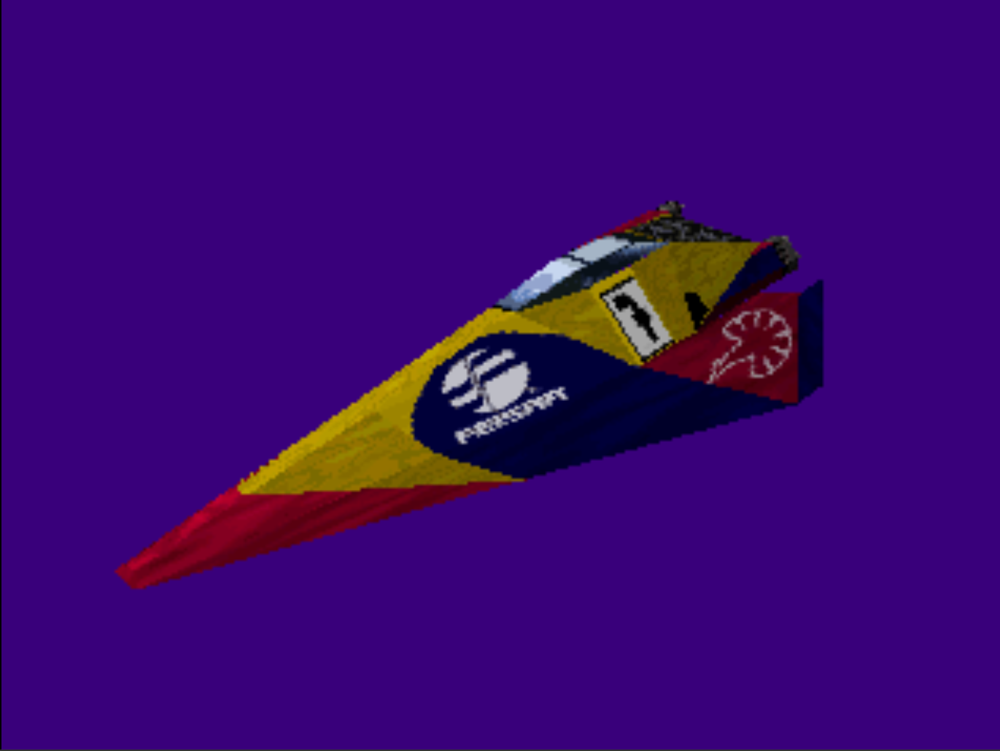
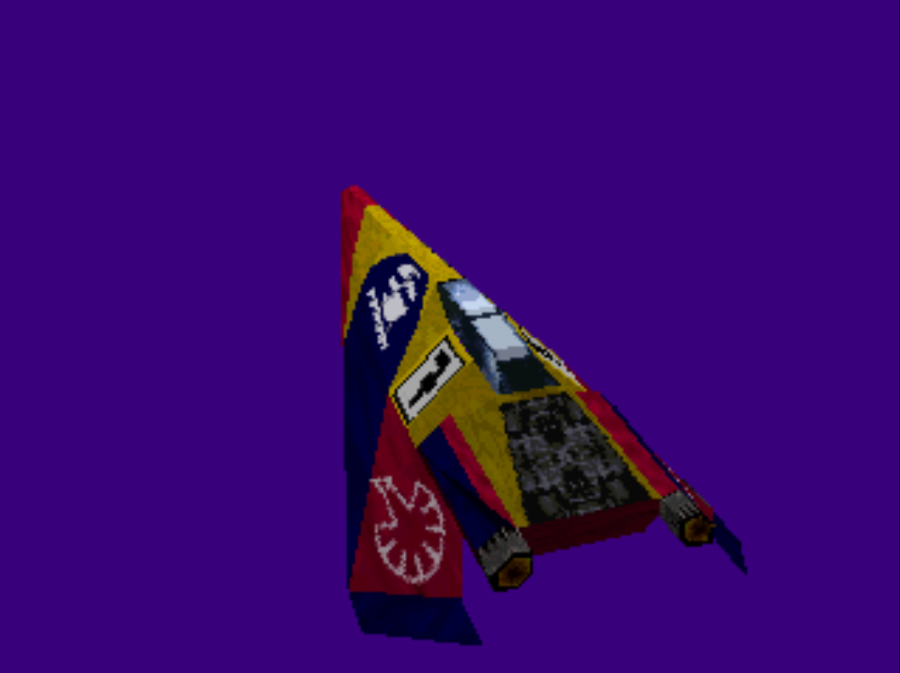
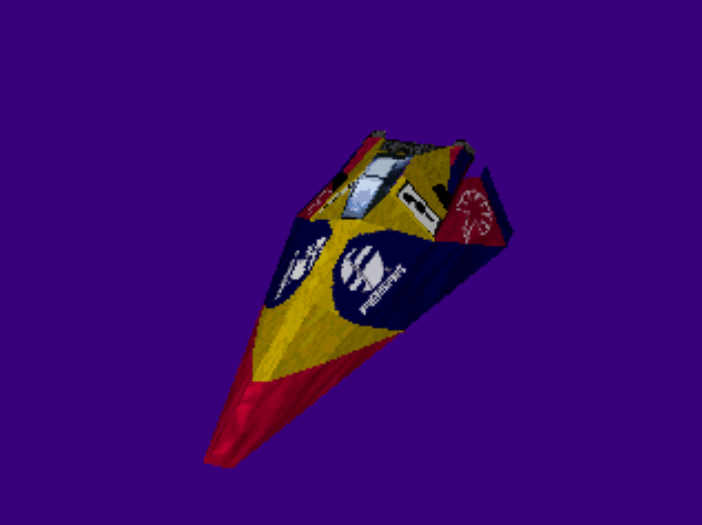

# Playstation Development - An exploration of Playstation Hardware and Games 
Having grown up playing consoles belonging to the various generations of PlayStation hardware, I have set out to understand deeply the constraints and lessons that can be learned by looking at consoles from the past. I've found that many of the concepts of video game development, such as working within the powers and limitations of hardware and making efficiency a priority have not changed between the PS1 development of the 90s and the cutting edge game development of today.

I am currently working through a number of resources on PS1 architecture, hardware and games software, particularly the PS1 programming course by Pikuma which covers not just low-level C but also involves significant amounts of MIPS Assembly programming, bringing me as close to the metal as possible. This has allowed me to use C and Assembly for understanding memory constraints and rendering when bandwidth and resources are limited. I've also come across the many quirks of developing specifically for a console ranging from simply having the correct cables, monitors and peripherals to keep developer quality of life as high as possible, all the way to building a project fit to run on real hardware, and not just the more forgiving emulators.

My chief goal of this project is to create a technical demo running on real PS3 hardware. PS1 and PS2 development are stages I am using as stepping stones to achieve that short to medium term goal. Given my experience with rendering and physics, I plan to create a demo for each console using one (or potentially even both) of those skills. Key project ideas I currently have are exploring efficient animation skinning through the generations, strong lighting showcases compared across the consoles or physics simulations which push the limit of the hardware and reinforce my capabilities in squeezing all possible performance within console constraints. 

Not only is this an exciting project from a nostalgia perspective, most importantly it continues to provide an excellent understanding of console development ensuring I can apply these skills in modern console development. All of my projects are tested on real hardware, while leveraging emulators for sense checking and quicker feedback loops in between major development milestones. 

## Latest Demo Examples

Figures 1-4: The same FEISAR Sofia ship model used by the Wipeout devs textured and rendered in my Wipeout clone. Working on both PS1 hardware and emulators. (Screenshots taken in emulator)